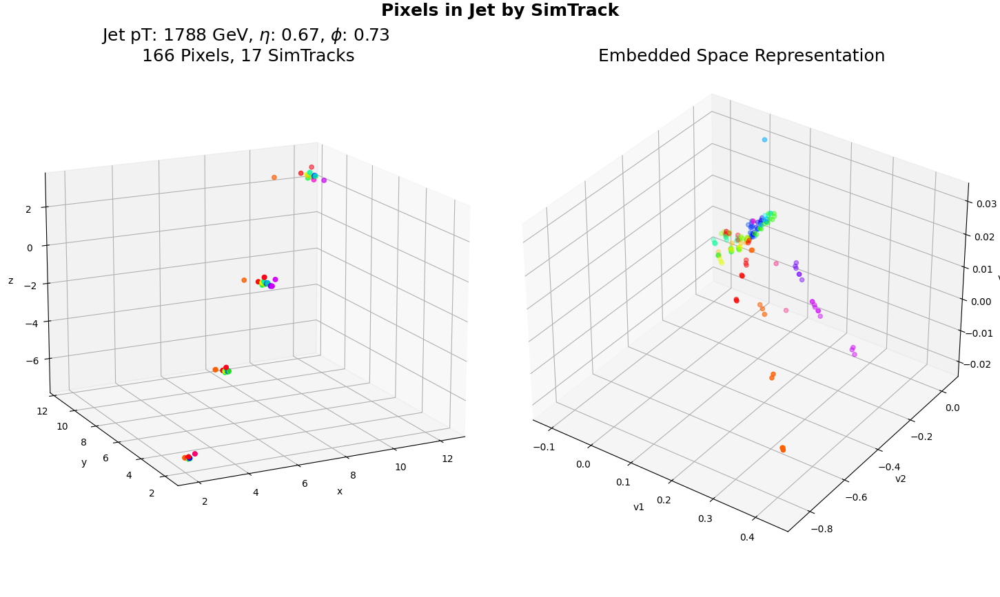

# GraphCore (Working Title)

### Josh's Version

Graph-based approach to track reconstruction in cores of jets.

Python3 virtual environment: `. env.sh`

`python plot.py` visualizes individual jets.

`python training.py` trains a neural network to cluster with a metric learning approach.

